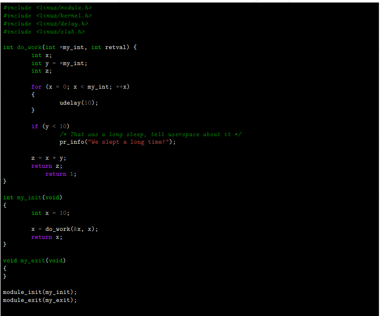
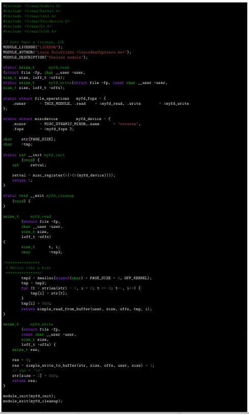

# Little Penguin

>  Le début d'une série de challenges inspirés du challenge Eudyptula, vous permettant d'aborder de nombreux points du developpement Kernel. 

## Launch the VM

The project is based on the ft-linux project where we had to make our Linux distribution.

Here, we start with this tiny distribution and do the challenges on it.

To lauch the VM, run the Vagrantfile :

```
vagrant up
```

And to connect on it with ssh

```
vagrant ssh
```

The current directory and all its content is synced (rsync) automatically in the VM on `/root/share` at the up

To re-sync if there is changes, run :

```
vagrant rsync
```

## 00

### Todo

- Download Linus’s latest git tree from git.kernel.org (You have to figure out whichone is his. It’s not that hard, just remember what his last name is and you shouldbe fine.)
- Build it, install it, and boot it. You can use whatever kernel configuration optionsyou wish to use, but you must enable CONFIG_LOCALVERSION_AUTO=y.

### Turn in

- Kernel boot log file.
- Your  ̇config file

### Notes

**CONFIG_LOCALVERSION_AUTO** : Automatically append version information to the version string.

Git clone the kernel in `/sources`:

```
git clone git://git.kernel.org/pub/scm/linux/kernel/git/torvalds/linux.git
```

To compile the new kernel with the good option, run the script `compile.sh`.

The script will compile the kernel. Copy the binaries to `/boot` and add an entry to the `/boot/grub/grub.cfg` file.

Restart the VM on VirtualBox and choose the good kernel in the menu.

To get the boot logs :

```
journalctl -b
```

## 01

### Todo

Build a "Hello World module" with the following behaviour:
```
% sudo insmod main.ko
% dmesg | tail -1
[Wed May 13 12:59:18 2015] Hello world !
% sudo rmmod main.ko
% dmesg | tail -1
[Wed May 13 12:59:24 2015] Cleaning up module.
%
```

### Turn in

Makefile and code

### Notes

Compile the module :

```
make
```

Insert the module :

```
insmod hello-world.ko
```

List the modules :

```
lsmod
```

Remove the module :

```
rmmod hello-world.ko
```

See the module output :

```
dmesg
```

## 02

### Todo

Take the kernel git tree from assignment 00 and change the Makefile to modify the **EXTRAVERSION** field. Do this in a way that the running kernel (after modifying the Makefile, rebuilding, and rebooting) has the characters "-thor_kernel" in theversion string.

### Turn in

- Kernel boot log
- A patch to the original Makefile, compliant with Linux standards (Documentation/-SubmittingPatches)

### Notes

[Submitting Patches](https://git.kernel.org/pub/scm/linux/kernel/git/torvalds/linux.git/tree/Documentation/process/submitting-patches.rst)

[guide-to-writing-your-first-linux-patch](https://medium.com/coinmonks/make-linux-kernel-better-beginners-guide-to-writing-your-first-linux-patch-1125e4891e0d)

[YouTube - Write and Submit your first Linux kernel Patch](https://www.youtube.com/watch?v=LLBrBBImJt4)

## 03

### Todo

Take the following file, and modify it to match the Linux coding style (Documentation/CodingStyle)



### Turn in

- Your version of the C file

### Notes

[CodingStyle](https://git.kernel.org/pub/scm/linux/kernel/git/torvalds/linux.git/tree/Documentation/process/coding-style.rst)

Check the style :

```
perl /sources/linux/scripts/checkpatch.pl -f ./file.c
```

## 04

### Todo

Take the kernel module you wrote for task 01, and modify it so that when any USB keyboard is plugged in, the module will be automatically loaded by the correct userspace hotplug tools (which are implemented by depmod / kmod / udev / mdev / systemd, depending on what distro you are using.)

### Turn in

- A rules file, depending on what system you are using.
- Your code
- Some proof that your code actually works!

### Notes

Compile the module :

```
make
```

Insert the module :

```
insmod hello-world.ko
```

List the modules :

```
lsmod
```

Remove the module :

```
rmmod hello-world.ko
```

See the module output :

```
dmesg
```

To register the udev rules, copy the file `usb-hello.rules` in the directory `/etc/udev/rules.d/`. Then reload the rules :

```
udevadm control --reload
```

**To test:**

Run `dmesg -w` to follow the logs and in the VirtualBox window, load the keyboard in USB and see the logs!

## 05

### Todo

- Take the kernel module you wrote for task 01, and modify it to be a misc char device driver. The misc interface is a very simple way to be able to create a character device, without having to worry about all of the sysfs and character device registration mess. And what a mess it is, so stick to the simple interfaces wherever possible.
- The misc device should be created with a dynamic minor number, no need to runoff and trying to reserve a real minor number for your test module, that would be crazy.
- The misc device should implement the read and write functions.
- The misc device node should show up in /dev/fortytwo.
- When the character device node is read from, your student login is returned to the caller.
- When the character device node is written to, the data sent to the kernel needs to be checked. If it matches your assigned student login, then return a correct write return value. If the value does not match your assigned student login, return the "invalid value" error value.
- The misc device should be registered when your module is loaded, and unregistered when it is unloaded.

### Turn in

- Your code
- Some proof

### Notes

[Miscellaneous Character Drivers](https://www.linuxjournal.com/article/2920)

Compile the module with the Makefile and insert it.

A device file `/dev/fortytwo` is now here, we can read on :

```
cat /dev/fortytwo ; echo
ndubouil
```

We can also write on it, if we write a random string :

```
printf coucou > /dev/fortytwo 
-bash: printf: write error: Invalid argument
```

Error! And with the login :

```
printf ndubouil > /dev/fortytwo
```

No error

## 06

### Todo

Download the linux-next kernel for today. Or tomorrow, just use the latest one. Itchanges every day so there is no specific one you need to pick. Build it. Boot it.

### Turn in

- Kernel boot log

What is the linux-next kernel? Ah, that’s part of the challenge. For a hint, you should read the excellent documentation about how the Linux kernel is developed in Documentation/development-process/ in the kernel source itself. It’s a great read, and should tell you all you never wanted to know about what Linux kernel developers do and how they do it.

### Notes

[Development Process](https://git.kernel.org/pub/scm/linux/kernel/git/torvalds/linux.git/tree/Documentation/process)

[Working with linux-next](https://www.kernel.org/doc/man-pages/linux-next.html)

[How the development process works](https://www.kernel.org/doc/html/v5.10/process/2.Process.html?highlight=next)

**The linux-next kernel is the branch to prepare the next version of the kernel**

Git clone the kernel in `/sources`:

```
git clone git://git.kernel.org/pub/scm/linux/kernel/git/torvalds/linux.git linux-next
cd linux-next
```

Then, add the linux-next remote

```
git remote add linux-next git://git.kernel.org/pub/scm/linux/kernel/git/next/linux-next.git
```

Finally, get the next changes

```
git fetch linux-next && git fetch --tags linux-next
```

To compile the new kernel with the good option, run the script `compile.sh`.

The script will compile the kernel. Copy the binaries to `/boot` and add an entry to the `/boot/grub/grub.cfg` file.

Restart the VM on VirtualBox and choose the good kernel in the menu.

To get the boot logs :

```
journalctl -b
```

## 07

### Todo

- Take the kernel module you wrote for task 01, and modify it to be create a debugfs subdirectory called "fortytwo". In that directory, create 3 virtual files called "id","jiffies", and "foo".
- The file "id" operates just like it did for assignment 05, use the same logic there, the file must be readable and writable by any user.
- The file "jiffies" is to be read only by any user, and when read, should return the current value of the jiffies kernel timer.
- The file "foo" needs to be writable only by root, but readable by anyone. When writing to it, the value must be stored, up to one page of data. When read, whichcan be done by any user, the value stored in it must be returned. Properly handle the fact that someone could be reading from the file while someone else is writing to it (oh, a locking hint!)
- When the module is unloaded, all of the debugfs files are cleaned up, and any memory allocated is freed.
- Note: Besides the file’s rights, the debug directory itself need to be readable by everyone. There’s no option for that, so let’s use that old good chown !

### Turn in

- Your code
- Some proof

### Notes

First, we need a kernel with the option `CONFIG_DEBUG_FS`. Recompile it with the script compile.sh

After the boot on the debug kernel, compile the module with the Makefile and insert it.

Now, in the directory in `/sys/kernel/debug/fortytwo/`, there is the 3 files (foo, id, jiffies)

**id**:

Like the previous challenge

```
cat /sys/kernel/debug/fortytwo/id ; echo
ndubouil
```

**jiffies**:

```
cat /sys/kernel/debug/fortytwo/jiffies;echo
cat /proc/timer_list | grep 'jiffies:'
```

**foo**:

```
echo "coucou" > /sys/kernel/debug/fortytwo/foo
cat /sys/kernel/debug/fortytwo/foo
coucou
```


[debugfs](https://www.kernel.org/doc/html/latest/filesystems/debugfs.html)

[debug noyau](https://perso.telecom-paristech.fr/duc/cours/tpt35/debug_noyau.html)

[Jiffies](http://books.gigatux.nl/mirror/kerneldevelopment/0672327201/ch10lev1sec3.html)

[mutex design](https://www.kernel.org/doc/html/latest/locking/mutex-design.html)

## 08

### Todo

- Take the following file, fix the coding style, and fix the behaviour of the code



### Turn in

- Your version of the C file

### Notes

[CodingStyle](https://git.kernel.org/pub/scm/linux/kernel/git/torvalds/linux.git/tree/Documentation/process/coding-style.rst)

Check the style :

```
perl /sources/linux/scripts/checkpatch.pl -f ./file.c
```

Compile and insert it!

```
make
make insert
```

The module create a misc char device to take a string on write and return the string reversed on read

```
$ cat /dev/reverse
$ echo -n coucou > /dev/reverse
$ cat /dev/reverse
uocuoc$
```

## 09

### Todo

- Create a module that can list mount points on your system, with the associatedname.
- Your file must be named /proc/mymounts

```
$> cat /proc/mymounts
root    /
sys     /sys
proc    /proc
run     /run
dev     /dev
```

### Turn in

- The module code, with a Makefile

Not a hard assignment, but really tricky. Read some docs about mountpoints, directory listing and linked-list loop in the Kernel. And have fun :)

### Notes

Compile and insert it.

```
cat /proc/mymounts
root                /
dev                 /dev
sys                 /sys
proc                /proc
shm                 /dev/shm
pts                 /dev/pts
run                 /run
cgroup              /sys/fs/cgroup
binfmt_misc         /proc/sys/fs/binfmt_misc
hugepages           /dev/hugepages
mqueue              /dev/mqueue
binfmt_misc/        /proc/sys/fs/binfmt_misc/
debug               /sys/kernel/debug
tracing             /sys/kernel/tracing
tmp                 /tmp
boot                /boot
```

Add a test tmpfs mountpoint :

```
mkdir /root/test_tmp
mount -vt tmpfs tmpfs /root/test_tmp
cat /proc/mymounts 
root                /
dev                 /dev
sys                 /sys
proc                /proc
shm                 /dev/shm
pts                 /dev/pts
run                 /run
cgroup              /sys/fs/cgroup
binfmt_misc         /proc/sys/fs/binfmt_misc
hugepages           /dev/hugepages
mqueue              /dev/mqueue
binfmt_misc/        /proc/sys/fs/binfmt_misc/
debug               /sys/kernel/debug
tracing             /sys/kernel/tracing
tmp                 /tmp
boot                /boot
test_tmp            /root/test_tmp
```

It works!

https://elixir.bootlin.com/linux/latest/source/include/linux/dcache.h#L89

https://elixir.bootlin.com/linux/latest/source/fs/mount.h#L8

https://stackoverflow.com/questions/46591203/get-all-mount-points-in-kernel-module

https://stackoverflow.com/questions/62984963/list-all-mount-points-in-kernel-module?noredirect=1&lq=1


## Resources


https://git.kernel.org/pub/scm/linux/kernel/git/torvalds/linux.git/

https://www.kernel.org/doc/html/v5.10/

[The Linux Kernel Module Programming Guide](https://tldp.org/LDP/lkmpg/2.6/html/x121.html)

https://medium.com/coinmonks/make-linux-kernel-better-beginners-guide-to-writing-your-first-linux-patch-1125e4891e0d


[Write and Submit your first Linux kernel Patch](https://www.youtube.com/watch?v=LLBrBBImJt4)

### Udev

https://www.tecmint.com/udev-for-device-detection-management-in-linux/

http://guidella.free.fr/General/ecrireReglePourUdev.html

https://static.lwn.net/images/pdf/LDD3/ch14.pdf

### device detection

https://sysplay.github.io/books/LinuxDrivers/book/Content/Part11.html


## Linux next

[Working with linux-next](https://www.kernel.org/doc/man-pages/linux-next.html)

[How the development process works](https://www.kernel.org/doc/html/v5.10/process/2.Process.html?highlight=next)

## debugfs

https://www.kernel.org/doc/html/latest/filesystems/debugfs.html

https://perso.telecom-paristech.fr/duc/cours/tpt35/debug_noyau.html

[Jiffies](http://books.gigatux.nl/mirror/kerneldevelopment/0672327201/ch10lev1sec3.html)

https://www.kernel.org/doc/html/latest/locking/mutex-design.html
